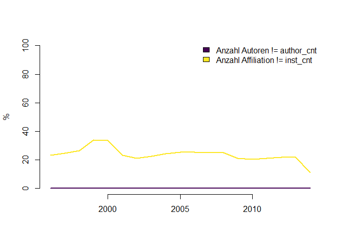

Fraktionierung auf Autorenebene
================
Stephan Stahlschmidt
17 Mai, 2017

Sachverhalt
===========

Waltman and Eck (2015) zeigen auf das full counting nicht kompatibel mit Feld-Normalisierung ist. Sie schlagen vor ein fractional counting auf Ebene der Autoren durchzuführen.

Hierbei entstehen zwei Schwierigkeiten:

1.  Verschiedene Autoren eines papers können der gleichen Institution angehören
2.  Autoren können gleichzeitig verschiedenen Institutionen angehören

Beispiel:

``` sql
SELECT fk_items, fk_authors, fk_institutions, type, pubyear, DOI
FROM wos12b.items it
JOIN wos12b.ITEMS_AUTHORS_INSTITUTIONS iai ON it.pk_items = iai.fk_items
WHERE fk_items = 1052207263
```

|   FK\_ITEMS|  FK\_AUTHORS|  FK\_INSTITUTIONS| TYPE |  PUBYEAR| DOI                          |
|-----------:|------------:|-----------------:|:-----|--------:|:-----------------------------|
|  1052207263|      1913084|          15316121| RP   |     2014| 10.1213/ANE.0000000000000115 |
|  1052207263|      1913084|          15316121| RS   |     2014| 10.1213/ANE.0000000000000115 |
|  1052207263|      6680839|          14174305| RS   |     2014| 10.1213/ANE.0000000000000115 |
|  1052207263|      8270088|          12973344| RS   |     2014| 10.1213/ANE.0000000000000115 |
|  1052207263|      8270088|           5810108| RS   |     2014| 10.1213/ANE.0000000000000115 |
|  1052207263|      1595434|          14174305| RS   |     2014| 10.1213/ANE.0000000000000115 |

Lösung: Basierend auf gut gepflegeten Daten kann die Fraktionierung auf Autorenebene und nachgelagerte Zuschreibung auf Institutionen wie folgt berechnet werden.

``` sql
SELECT DISTINCT fk_items, fk_institutions,
  SUM(inst_share) OVER (PARTITION BY fk_items, fk_institutions) AS inst_sum
FROM(
  SELECT fk_items, fk_institutions,
    (1/author_cnt)/(COUNT (fk_institutions) OVER (PARTITION BY fk_items, fk_authors)) AS inst_share
  FROM wos12b.items it
  JOIN wos12b.ITEMS_AUTHORS_INSTITUTIONS iai ON it.pk_items = iai.fk_items
  WHERE fk_items = 1052207263
    AND type = 'RS'
  )
```

|   FK\_ITEMS|  FK\_INSTITUTIONS|  INST\_SUM|
|-----------:|-----------------:|----------:|
|  1052207263|           5810108|      0.125|
|  1052207263|          15316121|      0.250|
|  1052207263|          14174305|      0.500|
|  1052207263|          12973344|      0.125|

Die Biliometriedatenbanken von WoS und Scopus unterscheiden sich in der Nutzung von *fk\_authors* und *type*. WoS führt die selbe *fk\_authors* ID einmal als *RP* und einmal als *RS*, während in Scopus für den corresponding author zwei verschiedene *fk\_authors* IDs vergeben werden, die sich in ihrem *type* (*RS* vs *RP*) unterscheiden. In beiden Datanbanken müssen corresponding authors mit dem *type RP* von der Fraktionierung ausgeschlossen werden.

Probleme
========

Die für die Fraktionierung benötigten Felder *fk\_authors*, *type*, *author\_cnt* und *fk\_institutions* sind nicht immer gut gepflegt.

Prozentualer Anteil von pk\_items mit vollständig oder anteilig fehlenden Informationen:

|      |  no author & affiliation|  no author type|  author w/o affiliation|  affiliation w/o authors|  total|
|------|------------------------:|---------------:|-----------------------:|------------------------:|------:|
| 2005 |                        0|            87.4|                    87.4|                     95.8|   99.2|
| 2006 |                        0|            87.7|                    87.7|                     96.0|   99.0|
| 2007 |                        0|            79.5|                    79.5|                     86.5|   90.2|
| 2008 |                        0|            22.6|                    22.6|                     25.2|   32.7|
| 2009 |                        0|            11.0|                    11.0|                     11.7|   20.7|
| 2010 |                        0|            10.4|                    10.4|                     11.0|   19.5|
| 2011 |                        0|             9.6|                     9.6|                     10.3|   18.2|
| 2012 |                        0|             9.3|                     9.3|                      9.7|   17.5|
| 2013 |                        0|             5.7|                     5.7|                      8.8|   13.0|
| 2014 |                        0|             4.4|                     4.4|                      8.2|   11.2|


Prozentualer Anteil von pk\_items mit Unterschieden in author\_cnt, bzw. inst\_cnt und Zählung der zugehörigen fk\_authors, bzw. fk\_institutions:

|      |  \# Autoren != author\_cnt|  \# Affiliationen != inst\_cnt|
|------|--------------------------:|------------------------------:|
| 2005 |                       94.9|                           24.0|
| 2006 |                       95.2|                           24.7|
| 2007 |                       85.9|                           24.8|
| 2008 |                       24.5|                           25.6|
| 2009 |                       11.0|                           26.7|
| 2010 |                       10.2|                           27.7|
| 2011 |                        9.7|                           28.6|
| 2012 |                        9.3|                           29.7|
| 2013 |                        8.5|                           31.6|
| 2014 |                        7.9|                           32.3|


Die ansteigende Differenz zwischen *inst\_cnt* und der Zählung *COUNT(DISTINCT fk\_institutions)* erklärt sich aus der Tatsache, dass für verschieden Untereinheiten einer Universität verschieden *fk\_institutions* vergeben werden, während *inst\_cnt* nur die aggregierte Einheit, sprich die Universität als ganzes, zählt.

Scopus
======

Die Datenqualität von Scopus erscheint signifikant besser zu sein, und zwar für den aktuellen Rand als auch insbesondere für vergangene Jahre.

Prozentualer Anteil von pk\_items mit fehlenden Informationen (Scopus):

|      |  no author & affiliation|  no author type|  author w/o affiliation|  affiliation w/o authors|  total|
|------|------------------------:|---------------:|-----------------------:|------------------------:|------:|
| 1996 |                        0|               0|                    10.9|                      0.0|   10.9|
| 1997 |                        0|               0|                    11.1|                      0.0|   11.1|
| 1998 |                        0|               0|                    10.8|                      0.0|   10.8|
| 1999 |                        0|               0|                    12.4|                      0.0|   12.4|
| 2000 |                        0|               0|                    10.5|                      0.0|   10.5|
| 2001 |                        0|               0|                    10.5|                      0.0|   10.5|
| 2002 |                        0|               0|                    10.3|                      0.0|   10.3|
| 2003 |                        0|               0|                    12.3|                      0.0|   12.3|
| 2004 |                        0|               0|                     8.5|                      0.0|    8.5|
| 2005 |                        0|               0|                     6.8|                      0.0|    6.8|
| 2006 |                        0|               0|                     6.0|                      0.0|    6.0|
| 2007 |                        0|               0|                     5.7|                      0.0|    5.7|
| 2008 |                        0|               0|                     5.0|                      0.0|    5.0|
| 2009 |                        0|               0|                     5.0|                      0.0|    5.0|
| 2010 |                        0|               0|                     6.1|                      0.0|    6.1|
| 2011 |                        0|               0|                     5.7|                      0.0|    5.7|
| 2012 |                        0|               0|                     5.3|                      0.0|    5.3|
| 2013 |                        0|               0|                     4.9|                      0.0|    4.9|
| 2014 |                        0|               0|                     3.7|                      0.1|    3.7|


Prozentualer Anteil von pk\_items mit Unterschieden in author\_cnt, bzw. inst\_cnt und Zählung der zugehörigen fk\_authors, bzw. fk\_institutions (Scopus):

|      |  \# Autoren != author\_cnt|  \# Affiliation != inst\_cnt|
|------|--------------------------:|----------------------------:|
| 1996 |                          0|                         23.2|
| 1997 |                          0|                         24.4|
| 1998 |                          0|                         26.3|
| 1999 |                          0|                         33.6|
| 2000 |                          0|                         33.0|
| 2001 |                          0|                         22.9|
| 2002 |                          0|                         21.0|
| 2003 |                          0|                         22.4|
| 2004 |                          0|                         24.2|
| 2005 |                          0|                         25.3|
| 2006 |                          0|                         25.1|
| 2007 |                          0|                         24.8|
| 2008 |                          0|                         24.8|
| 2009 |                          0|                         21.1|
| 2010 |                          0|                         20.4|
| 2011 |                          0|                         21.2|
| 2012 |                          0|                         21.6|
| 2013 |                          0|                         21.8|
| 2014 |                          0|                         11.2|



Zusammenfassung
===============

Für die gebotene Fraktionierung auf Autorenebene ist eine gut gepflegte Zuschreibung zwischen Autor und Institution essentiell.

Im WoS reduziert sich das Ausmaß fehlender Zuordnung zwischen Autor und Institution bisher nicht auf ein einstelliges Prozentniveau (normiert auf *pk\_items*), allerdings ist ein deutliche Verbesserung der Datenqualität ab 2008 beobachtbar.

In Scopus liegt die Rate von *pk\_items* mit ungenügender Zuordnung dagegen seit 2004 auf einstelligem Niveau und vorher auf sehr niedrigem zweistelligen Niveau. Verantworlich hierfür sind ausschießlich Autoren ohne zugeteilite affiliation.

Eine Nutzung der WoS für Fraktionierungszwecke erscheint, wenn überhaupt, nur für den aktuellen Rand angebracht, während Scopus Daten auch für die Vergangenheit ein ausreichendes Niveau aufweisen sollten.

In beiden Datenbanken kann der Anteil nicht integer Daten mittels Annahmen gesenkt werden. Beispeilhaft könnte eine einzelne ohne Bindung zu *fk\_authors* stehende *affiliation* auf alle Autoren angewandt werden, da mit hoher Wahrscheinlichkeit alle Autoren dieser *affiliation* angehören.

Literatur
=========

Waltman, L. and Eck, N.J. van. (2015), “Field-normalized citation impact indicators and the choice of an appropriate counting method”, *Journal of Informetrics*, Vol. 9 No. 4, pp. 872–894.
