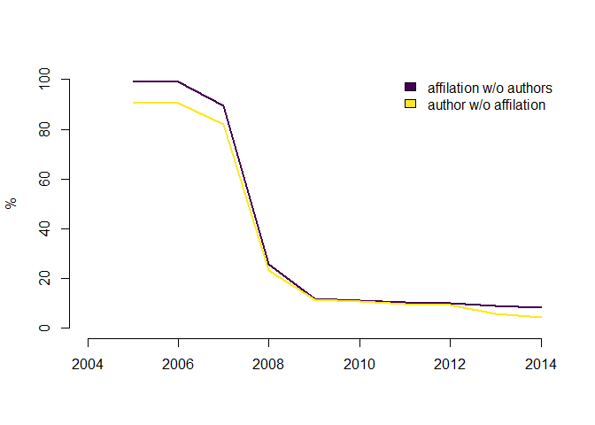
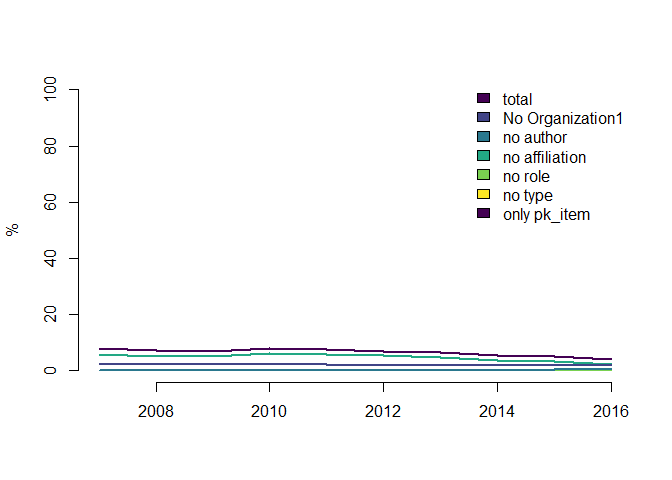

Fraktionierung auf Autorenebene
================
Stephan Stahlschmidt and Marion Schmidt
18 Oktober, 2018

-   [Motivation](#motivation)
-   [Potential Solution](#potential-solution)
-   [Data Quality](#data-quality)
-   [Implementation](#implementation)
-   [Caveats](#caveats)
-   [Comparison](#comparison)
-   [Scopus: scopus\_b\_2017](#scopus-scopus_b_2017)
    -   [Implementation in Scopus](#implementation-in-scopus)
    -   [Comparison](#comparison-1)
-   [Summing up](#summing-up)
-   [Literatur](#literatur)

Motivation
==========

Waltman and Eck (2015) demonstrate that whole counting is incompatible with field normalization. They propose fractional counting on the level of authors implemented by fractional counting on address strings.

In any such approach two issues arise:

1.  Several authors might be affiliated to the same organisation
2.  Single authors might be affiliated with several organisations

Example:

``` sql
SELECT fk_authors, fk_institutions, type, role, organization1, countrycode
FROM wos_b_2018.items it
LEFT JOIN wos_b_2018.items_authors_institutions iai ON it.pk_items = iai.fk_items
LEFT JOIN wos_b_2018.institutions inst ON inst.pk_institutions = iai.fk_institutions
WHERE ut_eid = '000262133500009'
```

|  FK\_AUTHORS|  FK\_INSTITUTIONS| TYPE | ROLE           | ORGANIZATION1            | COUNTRYCODE |
|------------:|-----------------:|:-----|:---------------|:-------------------------|:------------|
|      7955236|          21820728| RS   | author         | Charles Univ Prague      | CZE         |
|     10052410|          21820728| RS   | author         | Charles Univ Prague      | CZE         |
|     10052410|           3813050| RS   | author         | IPN                      | MEX         |
|     12295429|          21820728| RS   | author         | Charles Univ Prague      | CZE         |
|     19601371|                NA| RS   | researcher\_id | NA                       | NA          |
|     21176674|          26576092| RP   | author         | Sincrotrone Trieste SCpA | ITA         |
|     21176674|          21820728| RS   | author         | Charles Univ Prague      | CZE         |
|     21176674|          11533142| RS   | author         | Sincrotrone Trieste SCpA | ITA         |
|     24438445|                NA| RS   | researcher\_id | NA                       | NA          |

Potential Solution
==================

Fractional counting based on author attribution and subsequent aggregation to the levle of interest (here: countries) might be computed as follows:

``` sql
SELECT fk_items, countrycode, SUM(orga_frak) AS cntry_frac -- aggregating on country level
FROM( -- aggregating on organization1 level
    SELECT fk_items, organization1, countrycode, SUM(orga_share)  AS orga_frak
    FROM( -- computing fractional contribution of organsation on author level
      SELECT DISTINCT fk_items, organization1, countrycode, fk_authors,
        (1/(COUNT (DISTINCT fk_authors) OVER (PARTITION BY fk_items))) / 
        (COUNT (DISTINCT organization1) OVER (PARTITION BY fk_items, fk_authors)) AS orga_share
      FROM wos_b_2018.items it
      JOIN wos_b_2018.items_authors_institutions iai ON it.pk_items = iai.fk_items
      JOIN wos_b_2018.institutions inst ON inst.pk_institutions = iai.fk_institutions
      WHERE ut_eid = '000262133500009'
        AND role = 'author'
        AND type = 'RS'
      )
    GROUP BY fk_items, organization1, countrycode
)
GROUP BY fk_items, countrycode
```

|  FK\_ITEMS| COUNTRYCODE |  CNTRY\_FRAC|
|----------:|:------------|------------:|
|   28825338| ITA         |        0.125|
|   28825338| CZE         |        0.750|
|   28825338| MEX         |        0.125|

The *KB* versions of *Web of Science* and *Scopus* differ in their usage of *fk\_authors*, *type* and *role* (Why?). WoS holds the same *fk\_authors* as a corresponding author (*RP*) and as an ordinary author (*RS*), while SCP assigns two different *fk\_authors* for the same author which vary in their type (*RP* or *RS*). In any case entries for corresponding authors have to excluded via the *RP* type. Furthermore in the WoS authors have to be separated from other roles via *role = 'author'*.

Data Quality
============

Necessary information in variables like *Organization1*, *role* and *type* might not always be available and especially before 2008 the link between authors (*fk\_authors*) and their affiliated organisation (*fk\_institutions*) was most often only recorded for the corresponding author.

Percentages of pk\_items with partially missing information:

|      | only pk\_item |  no type|  no role|  no affiliation|  no author|  No Organization1|  total|
|------|:-------------:|--------:|--------:|---------------:|----------:|-----------------:|------:|
| 2007 |       0       |        0|     85.9|            88.9|       85.9|               2.1|   89.7|
| 2008 |       0       |        0|     14.2|            20.3|       14.2|               2.3|   23.7|
| 2009 |       0       |        0|     13.1|            20.2|       13.1|               2.3|   23.4|
| 2010 |       0       |        0|     12.5|            19.0|       12.5|               2.2|   22.2|
| 2011 |       0       |        0|     11.7|            17.6|       11.7|               2.1|   20.8|
| 2012 |       0       |        0|     11.1|            16.9|       11.1|               2.0|   19.8|
| 2013 |       0       |        0|     10.4|            12.3|       10.4|               1.9|   15.5|
| 2014 |       0       |        0|      9.9|            10.6|        9.9|               1.8|   13.9|
| 2015 |       0       |        0|      9.7|             8.4|        9.7|               1.7|   13.4|
| 2016 |       0       |        0|     10.9|             2.9|       10.9|               1.7|   14.2|
| 2017 |       0       |        0|      9.1|             2.8|        9.1|               1.8|   12.4|



<!-- ```{r tab_dif_author_counting, echo = FALSE, eval = FALSE} -->
<!-- # Differenz zwischen author_cnt und Zählung der fk_authors -->
<!-- dif_author_counting <- dbGetQuery(sql_pool, strwrap(paste0(" -->
<!--   SELECT pubyear, SUM(diff) -->
<!--   FROM( -->
<!--     SELECT DISTINCT fk_items, pubyear, -->
<!--       CASE  WHEN author_cnt = (COUNT(DISTINCT fk_authors) OVER (PARTITION BY fk_items)) -->
<!--               THEN 0 -->
<!--             ELSE 1 -->
<!--       END diff -->
<!--     FROM wos_b_2018.items it -->
<!--     JOIN wos_b_2018.ITEMS_AUTHORS_INSTITUTIONS iai ON it.pk_items = iai.fk_items -->
<!--     WHERE pubtype = 'Journal' -->
<!--       AND doctype IN ('Article', 'Review') -->
<!--       AND pubyear BETWEEN 2007 AND 2017 -->
<!--       AND type = 'RS' -->
<!--       AND role = 'author' -->
<!--   ) -->
<!--   GROUP BY pubyear -->
<!--   ORDER BY pubyear ASC -->
<!--   "), -->
<!--   width = 100000, simplify = TRUE) -->
<!--   ) -->
<!-- ``` -->
<!-- Prozentualer Anteil von pk_items mit Unterschieden in author_cnt und Zählung der zugehörigen fk_authors: -->
<!-- ```{r tab_diff, echo = FALSE, eval = FALSE} -->
<!-- tmp <- as.matrix(dif_author_counting[,2]/papersByYear[,2] * 100) -->
<!-- rownames(tmp) <- as.character(2007:2017) -->
<!-- kable(tmp, -->
<!--       digits = 1, -->
<!--       row.names = TRUE, -->
<!--       col.names=c("# Autoren != author_cnt")) -->
<!-- matplot(2007:2017, tmp, -->
<!--      xlim=c(2007,2017), -->
<!--      ylim=c(0,100), -->
<!--      lwd=2, -->
<!--      lty=1, -->
<!--      bty="n", -->
<!--      xlab="", -->
<!--      ylab="%", -->
<!--      type="l", -->
<!--      col=viridis(2)) -->
<!-- # legend("topright", -->
<!-- #        legend = c("# Autoren != author_cnt", "# Affiliationen != inst_cnt"), -->
<!-- #        fill=viridis(2), -->
<!-- #        bty = "n") -->
<!-- ``` -->
Implementation
==============

Due to large shares of items with incomplete information we propose a hybrid spproach. We (1) fractionalize on the author level (and subsequently aggregate to the country level) for every pk\_item with complete information in the *items\_authors\_institutions* table and (2) apply fractionalization on the organisation level (and therefore ignore any authors) via *organization1* for all other pk\_items. Hence we follow Waltman and Eck (2015) but account for data quality issues at the same time.

In detail we compute a table which holds country specific weights for fractional counting. Lower aggregates levels like organisations might also be computed.

``` sql
DROP TABLE items_iai_complete;
DROP TABLE wosb2018_frc_cntrylvl;

/*
Create temporaray table as an indicator of items with complete iai record:
*/
CREATE GLOBAL TEMPORARY TABLE items_iai_complete (
    fk_items NUMBER
)
ON COMMIT DELETE ROWS;

/*
create empty table defining fractional weight for every paper by country
causes implicit commit
*/
CREATE TABLE wosb2018_frc_cntrylvl (
    fk_items NUMBER,
    countrycode VARCHAR2(10 CHAR),
    frac_share NUMBER(3,2),
    ind_complete NUMBER(1,0)
);

/*
populate temporary table
*/
INSERT INTO items_iai_complete (
SELECT DISTINCT tmp.fk_items -- subset of items with complete iai information
FROM( -- counts numbers of entries in iai for every item
    SELECT fk_items, COUNT (*) AS entry_cnt
    FROM wos_b_2018.items it
    LEFT JOIN wos_b_2018.ITEMS_AUTHORS_INSTITUTIONS iai ON it.pk_items = iai.fk_items
    LEFT JOIN wos_b_2018.institutions inst ON inst.pk_institutions = iai.fk_institutions
    WHERE (role IS NULL OR role = 'author') -- we only care for authors and missing information, other roles are neglected
        AND pubtype = 'Journal'
        AND doctype IN ('Article', 'Review')
        AND pubyear BETWEEN 2007 AND 2017
    GROUP BY fk_items
) tmp
JOIN( -- counts numbers of COMPLETE entries in iai for every item
    SELECT fk_items, COUNT (*) AS entry_cnt
    FROM wos_b_2018.items it
    LEFT JOIN wos_b_2018.ITEMS_AUTHORS_INSTITUTIONS iai ON it.pk_items = iai.fk_items
    LEFT JOIN wos_b_2018.institutions inst ON inst.pk_institutions = iai.fk_institutions
    WHERE pubtype = 'Journal'
        AND doctype IN ('Article', 'Review')
        AND pubyear BETWEEN 2007 AND 2017
        AND fk_institutions IS NOT NULL
        AND fk_authors IS NOT NULL
        AND role = 'author'
        AND type IS NOT NULL
    GROUP BY fk_items
) tmp2 ON tmp.fk_items = tmp2.fk_items
AND tmp.entry_cnt = tmp2.entry_cnt); -- compare both numbers

/*
include items with COMPLETE iai information via fractional counting on author level:
*/
INSERT INTO wosb2018_frc_cntrylvl
SELECT fk_items, countrycode, SUM(orga_frak) AS frac_share, 1 -- aggregating on country level
FROM( -- aggregating on organization1 level
    SELECT fk_items, organization1, countrycode, SUM(orga_share)  AS orga_frak
    FROM( -- computing fractional contribution of organsation on author level
      SELECT DISTINCT fk_items, ORGANIZATION1, countrycode, fk_authors,
        (1/(COUNT (DISTINCT fk_authors) OVER (PARTITION BY fk_items)))
        /(COUNT (DISTINCT organization1) OVER (PARTITION BY fk_items, fk_authors)) AS orga_share
      FROM wos_b_2018.items it
      JOIN wos_b_2018.ITEMS_AUTHORS_INSTITUTIONS iai ON it.pk_items = iai.fk_items
      JOIN wos_b_2018.institutions inst ON inst.pk_institutions = iai.fk_institutions
      WHERE pubtype = 'Journal'
        AND doctype IN ('Article', 'Review')
        AND pubyear BETWEEN 2007 AND 2017
        AND role = 'author'
        AND type = 'RS'
        AND pk_items IN (SELECT fk_items FROM items_iai_complete)
        AND organization1 IS NOT NULL
      )
    GROUP BY fk_items, organization1, countrycode
)
GROUP BY fk_items, countrycode, 1;

/*
include items with INCOMPLETE iai information via fractional counting on organization level:
*/
INSERT INTO wosb2018_frc_cntrylvl
SELECT fk_items, countrycode, SUM(orga_frak) AS frac_share, 0 -- aggregating on country level
FROM( -- aggregating on organization1 level
    SELECT fk_items, organization1, countrycode, SUM(orga_share)  AS orga_frak
    FROM( -- computing fractional contribution on organisation level
      SELECT DISTINCT fk_items, ORGANIZATION1, countrycode,
        (1/(COUNT (DISTINCT organization1) OVER (PARTITION BY fk_items))) AS orga_share
      FROM wos_b_2018.items it
      JOIN wos_b_2018.ITEMS_AUTHORS_INSTITUTIONS iai ON it.pk_items = iai.fk_items
      JOIN wos_b_2018.institutions inst ON inst.pk_institutions = iai.fk_institutions
      WHERE pubtype = 'Journal'
        AND doctype IN ('Article', 'Review')
        AND pubyear BETWEEN 2007 AND 2017
        AND (role = 'author' OR role IS NULL)
        AND type = 'RS'
        AND pk_items NOT IN (SELECT fk_items FROM items_iai_complete)
        AND organization1 IS NOT NULL
      )
    GROUP BY fk_items, organization1, countrycode
)
GROUP BY fk_items, countrycode, 0;

CREATE INDEX wosb2018_frc_cntrylvl_ix ON wosb2018_frc_cntrylvl (fk_items, countrycode);

COMMIT;
```

Caveats
=======

-   Whenever an authors holds several affiliations of which two or more actually describe the same organisation, but have not been cleaned in *organization1*, we assign erroneous weights. This issue might be less severe on a country level analysis and could ultimately only be resolved via a worldwide institution harmonization.
-   Affiliations without an *organzation1* are omitted, e.g. private addresses (1,2% in wos\_b\_2018)
-   anonymous authors (*role = 'anon'*) are omitted
-   Any other?

Comparison
==========

As an alternative implementation we also compute weights based on fractionation on the *organization1* level:

``` sql

/*
create empty table defining fractional weight for every paper by country
based on fractionation on organization1 level
*/
CREATE TABLE wosb2018_frc_cntrylvl_org1 (
    fk_items NUMBER,
    countrycode VARCHAR2(10 CHAR),
    frac_share NUMBER(3,2)
);

/*
include items with INCOMPLETE iai information via fractional counting on organization level:
*/
INSERT INTO wosb2018_frc_cntrylvl_org1
SELECT fk_items, countrycode, SUM(orga_frak) AS frac_share -- aggregating on country level
FROM( -- aggregating on organization1 level
    SELECT fk_items, organization1, countrycode, SUM(orga_share)  AS orga_frak
    FROM( -- computing fractional contribution on organisation level
      SELECT DISTINCT fk_items, ORGANIZATION1, countrycode,
        (1/(COUNT (DISTINCT organization1) OVER (PARTITION BY fk_items))) AS orga_share
      FROM wos_b_2018.items it
      JOIN wos_b_2018.ITEMS_AUTHORS_INSTITUTIONS iai ON it.pk_items = iai.fk_items
      JOIN wos_b_2018.institutions inst ON inst.pk_institutions = iai.fk_institutions
      WHERE pubtype = 'Journal'
        AND doctype IN ('Article', 'Review')
        AND pubyear BETWEEN 2007 AND 2017
        AND (role = 'author' OR role IS NULL)
        AND type = 'RS'
        AND organization1 IS NOT NULL
      )
    GROUP BY fk_items, organization1, countrycode
)
GROUP BY fk_items, countrycode;

CREATE INDEX wosb2018_frc_cntrylvl_org1_ix ON wosb2018_frc_cntrylvl_org1 (fk_items, countrycode);

COMMIT;
```

Computing fractional counts of publications on national level for 2017:

    ##    COUNTRY PUBYEAR PUB_CNT_FRAK COUNTRY PUBYEAR PUB_CNT_FRAK_ISI
    ## 1      USA    2017    328073.57     USA    2017        331041.62
    ## 2      CHN    2017    311121.04     CHN    2017        305744.47
    ## 3      GBR    2017     78520.46     GBR    2017         79872.01
    ## 4      DEU    2017     75084.54     DEU    2017         74758.39
    ## 5      JPN    2017     66966.03     JPN    2017         67103.65
    ## 6      IND    2017     64531.10     IND    2017         64106.29
    ## 7      ITA    2017     50607.04     KOR    2017         50231.04
    ## 8      KOR    2017     50598.08     ITA    2017         49944.34
    ## 9      FRA    2017     48023.17     FRA    2017         48992.85
    ## 10     CAN    2017     47401.28     CAN    2017         47639.40
    ## 11     ESP    2017     42819.01     ESP    2017         42589.21
    ## 12     BRA    2017     40370.46     BRA    2017         39833.05
    ## 13     RUS    2017     31265.91     RUS    2017         31452.20
    ## 14     NLD    2017     24824.52     NLD    2017         24555.48
    ## 15     POL    2017     22399.12     POL    2017         22297.40
    ## 16     CHE    2017     16814.71     CHE    2017         16910.97
    ## 17     SWE    2017     16648.02     SWE    2017         16837.00
    ## 18     BEL    2017     12704.28     BEL    2017         12672.35
    ## 19     DNK    2017     11627.22     DNK    2017         11566.10
    ## 20     ISR    2017     10329.89     ISR    2017         10336.78
    ## 21     ZAF    2017      9759.97     ZAF    2017          9754.36
    ## 22     AUT    2017      9094.32     AUT    2017          9044.01
    ## 23     FIN    2017      8251.95     FIN    2017          8184.44

Only Italy and Korea swap places in this ranking of productivity.

Scopus: scopus\_b\_2017
=======================

Die Datenqualität von Scopus erscheint signifikant besser zu sein, und zwar für den aktuellen Rand als auch insbesondere für vergangene Jahre.

Prozentualer Anteil von pk\_items mit fehlenden Informationen (Scopus):

|      |  no author nor affiliation|  no author type|  author w/o affiliation|  affiliation w/o authors|  no organization1|  total|
|------|--------------------------:|---------------:|-----------------------:|------------------------:|-----------------:|------:|
| 2007 |                          0|               0|                     5.7|                      0.0|               2.5|    7.9|
| 2008 |                          0|               0|                     5.0|                      0.0|               2.4|    7.1|
| 2009 |                          0|               0|                     5.0|                      0.0|               2.1|    6.9|
| 2010 |                          0|               0|                     6.1|                      0.0|               2.1|    7.9|
| 2011 |                          0|               0|                     5.7|                      0.0|               2.1|    7.5|
| 2012 |                          0|               0|                     5.3|                      0.0|               1.9|    7.0|
| 2013 |                          0|               0|                     4.8|                      0.0|               1.8|    6.4|
| 2014 |                          0|               0|                     3.8|                      0.1|               1.9|    5.5|
| 2015 |                          0|               0|                     3.2|                      0.3|               1.9|    5.1|
| 2016 |                          0|               0|                     2.1|                      0.3|               1.9|    3.9|



<!-- ```{r, tab_dif_author_counting_sc, echo=FALSE, eval=FALSE} -->
<!-- # Differenz zwischen author_cnt und Zählung der fk_authors -->
<!-- dif_author_counting_sc <- dbGetQuery(sql_pool, strwrap(paste0(" -->
<!--   SELECT pubyear, SUM(diff) -->
<!--   FROM( -->
<!--     SELECT DISTINCT fk_items, pubyear, -->
<!--       CASE  WHEN author_cnt = (COUNT(DISTINCT fk_authors) OVER (PARTITION BY fk_items)) -->
<!--               THEN 0 -->
<!--             ELSE 1 -->
<!--       END diff -->
<!--     FROM scopus_b_2017.items it -->
<!--     JOIN scopus_b_2017.ITEMS_AUTHORS_INSTITUTIONS iai ON it.pk_items = iai.fk_items -->
<!--     WHERE pubtype = 'J' -->
<!--     AND doctype IN ('ar', 're') -->
<!--     AND pubyear BETWEEN 2007 AND 2016 -->
<!--     AND (type = 'RS' OR type IS NULL) -->
<!--   ) -->
<!--   GROUP BY pubyear -->
<!--   ORDER BY pubyear ASC -->
<!--   "), -->
<!--   width = 100000, simplify = TRUE) -->
<!--   ) -->
<!-- ``` -->
<!-- Prozentualer Anteil von pk_items mit Unterschieden in author_cnt und Zählung der zugehörigen fk_authors (Scopus): -->
<!-- ```{r, tab_diff_sc, echo=FALSE, eval=FALSE, cache=FALSE} -->
<!-- tmp <- as.matrix(dif_author_counting_sc[,2]/papersByYear_sc[,2] * 100) -->
<!-- rownames(tmp) <- as.character(2007:2016) -->
<!-- colnames(tmp) <- c("# Autoren != author_cnt") -->
<!-- kable(tmp, -->
<!--       digits = 1, -->
<!--       row.names = TRUE) -->
<!-- matplot(2007:2016, tmp, -->
<!--      xlim=c(2007,2016), -->
<!--      ylim=c(0,100), -->
<!--      lwd=2, -->
<!--      lty=1, -->
<!--      bty="n", -->
<!--      xlab="", -->
<!--      ylab="%", -->
<!--      type="l", -->
<!--      col=viridis(2)) -->
<!-- # legend("topright", -->
<!-- #        legend = c("# Autoren != author_cnt", "# Affiliation != inst_cnt"), -->
<!-- #        fill=viridis(2), -->
<!-- #        bty = "n") -->
<!-- ``` -->
Implementation in Scopus
------------------------

``` sql
DROP TABLE items_iai_complete_scp;
DROP TABLE scopusb2017_frc_cntrylvl;

/*
Create temporaray table as an indicator of items with complete iai record:
*/
CREATE GLOBAL TEMPORARY TABLE items_iai_complete_scp (
    fk_items NUMBER
)
ON COMMIT DELETE ROWS;

/*
create empty table defining fractional weight for every paper by country
causes implicit commit
*/
CREATE TABLE scopusb2017_frc_cntrylvl (
    fk_items NUMBER,
    countrycode VARCHAR2(10 CHAR),
    frac_share NUMBER(3,2),
    ind_complete NUMBER(1,0)
);

/*
populate temporary table
*/
INSERT INTO items_iai_complete_scp (
SELECT DISTINCT tmp.fk_items -- subset of items with complete iai information
FROM( -- counts numbers of entries in iai for every item
    SELECT fk_items, COUNT (*) AS entry_cnt
    FROM scopus_b_2017.items it
    LEFT JOIN scopus_b_2017.ITEMS_AUTHORS_INSTITUTIONS iai ON it.pk_items = iai.fk_items
    LEFT JOIN scopus_b_2017.institutions inst ON inst.pk_institutions = iai.fk_institutions
    WHERE pubtype = 'J'
        AND doctype IN ('ar', 're')
        AND pubyear BETWEEN 2007 AND 2016
    GROUP BY fk_items
) tmp
JOIN( -- counts numbers of COMPLETE entries in iai for every item
    SELECT fk_items, COUNT (*) AS entry_cnt
    FROM scopus_b_2017.items it
    LEFT JOIN scopus_b_2017.ITEMS_AUTHORS_INSTITUTIONS iai ON it.pk_items = iai.fk_items
    LEFT JOIN scopus_b_2017.institutions inst ON inst.pk_institutions = iai.fk_institutions
    WHERE pubtype = 'J'
        AND doctype IN ('ar', 're')
        AND pubyear BETWEEN 2007 AND 2016
        AND fk_institutions IS NOT NULL
        AND fk_authors IS NOT NULL
        AND type IS NOT NULL
    GROUP BY fk_items
) tmp2 ON tmp.fk_items = tmp2.fk_items
AND tmp.entry_cnt = tmp2.entry_cnt); -- compare both numbers

/*
include items with COMPLETE iai information via fractional counting on author level:
*/
INSERT INTO scopusb2017_frc_cntrylvl
SELECT fk_items, countrycode, SUM(orga_frak) AS frac_share, 1 -- aggregating on country level
FROM( -- aggregating on organization1 level
    SELECT fk_items, organization1, countrycode, SUM(orga_share)  AS orga_frak
    FROM( -- computing fractional contribution of organsation on author level
      SELECT DISTINCT fk_items, ORGANIZATION1, countrycode, fk_authors,
        (1/(COUNT (DISTINCT fk_authors) OVER (PARTITION BY fk_items)))/(COUNT (DISTINCT organization1) OVER (PARTITION BY fk_items, fk_authors)) AS orga_share
      FROM scopus_b_2017.items it
      JOIN scopus_b_2017.ITEMS_AUTHORS_INSTITUTIONS iai ON it.pk_items = iai.fk_items
      JOIN scopus_b_2017.institutions inst ON inst.pk_institutions = iai.fk_institutions
      WHERE pubtype = 'J'
        AND doctype IN ('ar', 're')
        AND pubyear BETWEEN 2007 AND 2016
        AND type = 'RS'
        AND pk_items IN (SELECT fk_items FROM items_iai_complete_scp)
        AND organization1 IS NOT NULL
      )
    GROUP BY fk_items, organization1, countrycode
)
GROUP BY fk_items, countrycode, 1;

/*
include items with INCOMPLETE iai information via fractional counting on organization level:
*/
INSERT INTO scopusb2017_frc_cntrylvl
SELECT fk_items, countrycode, SUM(orga_frak) AS frac_share, 0 -- aggregating on country level
FROM( -- aggregating on organization1 level
    SELECT fk_items, organization1, countrycode, SUM(orga_share)  AS orga_frak
    FROM( -- computing fractional contribution on organisation level
      SELECT DISTINCT fk_items, ORGANIZATION1, countrycode,
        (1/(COUNT (DISTINCT organization1) OVER (PARTITION BY fk_items))) AS orga_share
      FROM scopus_b_2017.items it
      JOIN scopus_b_2017.ITEMS_AUTHORS_INSTITUTIONS iai ON it.pk_items = iai.fk_items
      JOIN scopus_b_2017.institutions inst ON inst.pk_institutions = iai.fk_institutions
      WHERE pubtype = 'J'
        AND doctype IN ('ar', 're')
        AND pubyear BETWEEN 2007 AND 2016
        AND type = 'RS'
        AND pk_items NOT IN (SELECT fk_items FROM items_iai_complete_scp)
        AND organization1 IS NOT NULL
      )
    GROUP BY fk_items, organization1, countrycode
)
GROUP BY fk_items, countrycode, 0;

CREATE INDEX scpb2018_frc_cntrylvl_ix ON scopusb2017_frc_cntrylvl (fk_items, countrycode);

COMMIT;
```

Comparison
----------

As an alternative implementation we also compute weights based on fractionation on the *organization1* level:

``` sql

/*
create empty table defining fractional weight for every paper by country
based on fractionation on organization1 level
*/
CREATE TABLE scopusb2017_frc_cntrylvl_org1 (
    fk_items NUMBER,
    countrycode VARCHAR2(10 CHAR),
    frac_share NUMBER(3,2)
);

/*
include items with INCOMPLETE iai information via fractional counting on organization level:
*/
INSERT INTO scopusb2017_frc_cntrylvl_org1
SELECT fk_items, countrycode, SUM(orga_frak) AS frac_share -- aggregating on country level
FROM( -- aggregating on organization1 level
    SELECT fk_items, organization1, countrycode, SUM(orga_share)  AS orga_frak
    FROM( -- computing fractional contribution on organisation level
      SELECT DISTINCT fk_items, ORGANIZATION1, countrycode,
        (1/(COUNT (DISTINCT organization1) OVER (PARTITION BY fk_items))) AS orga_share
      FROM scopus_b_2017.items it
      JOIN scopus_b_2017.ITEMS_AUTHORS_INSTITUTIONS iai ON it.pk_items = iai.fk_items
      JOIN scopus_b_2017.institutions inst ON inst.pk_institutions = iai.fk_institutions
      WHERE pubtype = 'J'
        AND doctype IN ('ar', 're')
        AND pubyear BETWEEN 2007 AND 2016
        AND type = 'RS'
        AND organization1 IS NOT NULL
      )
    GROUP BY fk_items, organization1, countrycode
)
GROUP BY fk_items, countrycode;

CREATE INDEX scpb2017_frc_cntrylvl_org1_idx ON scopusb2017_frc_cntrylvl_org1 (fk_items, countrycode);

COMMIT;
```

Computing fractional counts of publications on national level for 2016:

    ##    COUNTRY PUBYEAR PUB_CNT_FRAK COUNTRY PUBYEAR PUB_CNT_FRAK_ISI
    ## 1      CHN    2016    342649.60     CHN    2016        338204.02
    ## 2      USA    2016    333195.54     USA    2016        335849.18
    ## 3      IND    2016     87121.46     IND    2016         86700.66
    ## 4      GBR    2016     82915.05     GBR    2016         84107.96
    ## 5      DEU    2016     77642.77     DEU    2016         77418.07
    ## 6      JPN    2016     71628.66     JPN    2016         71793.26
    ## 7      ITA    2016     54316.43     KOR    2016         53907.14
    ## 8      KOR    2016     54093.73     FRA    2016         53757.73
    ## 9      FRA    2016     52950.69     ITA    2016         53678.30
    ## 10     CAN    2016     47786.34     CAN    2016         48078.08
    ## 11     ESP    2016     46862.25     ESP    2016         46517.16
    ## 12     BRA    2016     45468.12     BRA    2016         45066.48
    ## 13     RUS    2016     44004.81     RUS    2016         44208.74
    ## 14     NLD    2016     25578.36     NLD    2016         25380.92
    ## 15     POL    2016     24674.90     POL    2016         24586.92
    ## 16     CHE    2016     16855.87     CHE    2016         16936.08
    ## 17     SWE    2016     16671.90     SWE    2016         16809.12
    ## 18     BEL    2016     13405.68     BEL    2016         13273.06
    ## 19     DNK    2016     11332.21     DNK    2016         11300.38
    ## 20     ZAF    2016     10513.25     ZAF    2016         10538.46
    ## 21     ISR    2016     10165.89     ISR    2016         10152.20
    ## 22     AUT    2016      9151.00     AUT    2016          9140.63
    ## 23     FIN    2016      8538.39     FIN    2016          8489.98

Summing up
==========

The implications of the adapted counting method seems rather minor on the chosen analysis level of countries.

Fractionation on the author level relies on complete information on the affiliations of single authors.

In the WoS the share of items with incomplete records constantly constitutes a substantial part of the corpus. Although data quality has strongly improved since 2008, still for 2017 more than 10% of all articles and reviews are incomplete. Furthermore data quality apparently gets improved every year, but the rate of improvement has slowed down considerably in the last years.

<!-- Socpus holds less incomplete recods, their share has been below 10% for all years since the first observation year 2007. -->
Consequently fractionizing on the author level seems only reasonable on complete records, whereas incomplete records might be fractionoized on the *organization1* level. Both approaches could be improved via a wordwide institution harmonization, which has partially be done by ISI Karlsruhe for their EFI reports.

Literatur
=========

Waltman, L. and Eck, N.J. van. (2015), “Field-normalized citation impact indicators and the choice of an appropriate counting method”, *Journal of Informetrics*, Vol. 9 No. 4, pp. 872–894.
